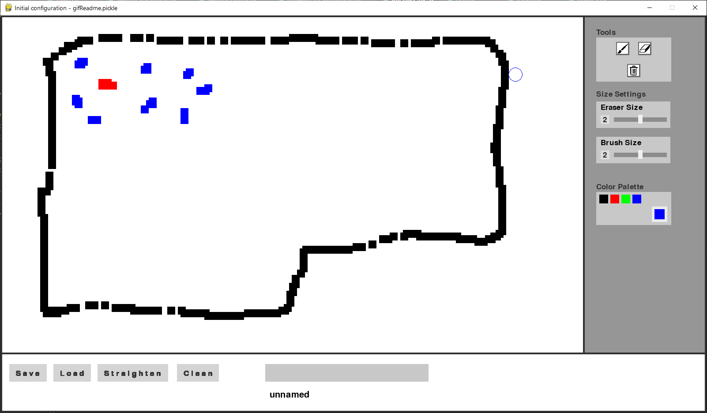
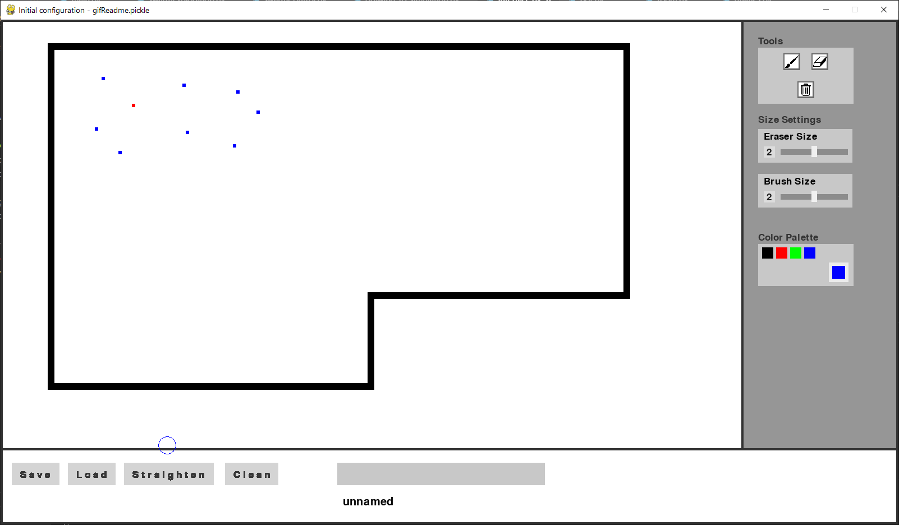
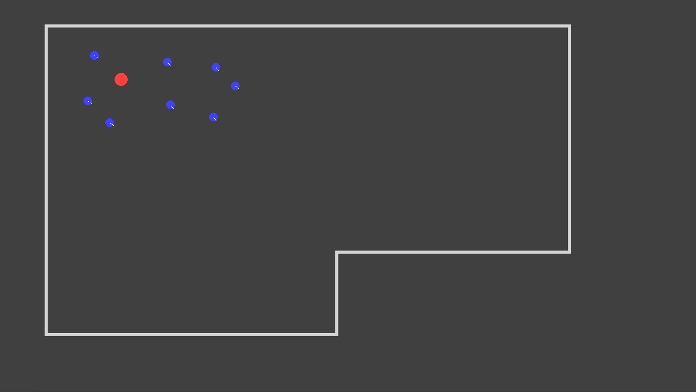
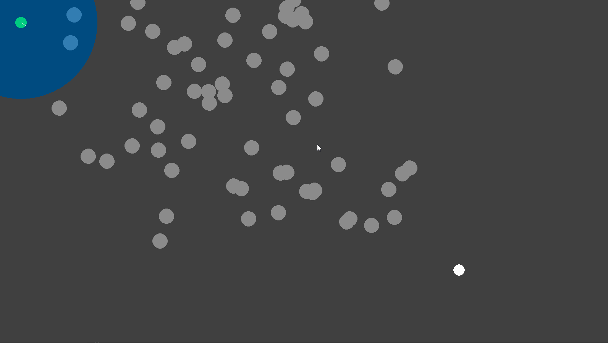
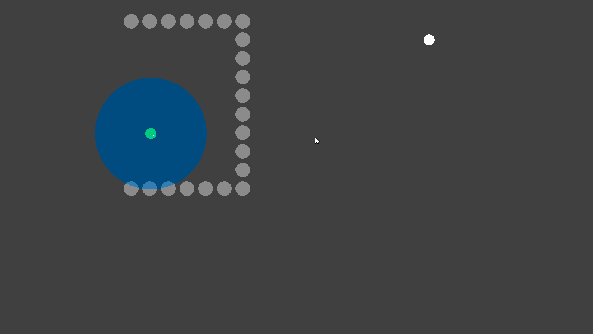

# Essaim_de_robots
Projet 2A CentraleSupélec sur le développement d'algorithmes de commande d'un essaim de robots.

## Simulation graphique

La simulation graphique consiste en une interface de type Paint sur laquelle on peut dessiner le plan de la pièce puis y ajouter des robots de différents types. Chaque couleur correspond à un type de robot : bleu pour un robot point de repère, vert pour un robot explorateur, et rouge pour un robot mesureur.

</img>

Une fois la pièce dessinée, on peut utiliser les boutons "straighten" et "clean" pour obtenir une version propre du plan de la pièce.

</img> 

Finalement, le dessin de la pièce et des différents robots est traduit en une simulation du fonctionnement de l'essaim de robots dans la pièce dessinée.

</img>

  
## Algorithme de détection et d'évitement d'obstacles

Lors du fonctionnement de l'essaim, chaque robot va se fixer différents objectifs les uns à la suite des autres. Pour pouvoir les atteindre, il doit détecter les obstacles qui se trouvent sur son chemin, qu'ils soient fixes ou mobiles (comme d'autres robots par exemple), et essayer de les éviter.
L'algorithme d'évitement d'obstacles et donc un des principaux algorithmes régissant le comportement des robots.
Nous vous présentons ci-dessous deux des challenges techniques auxquels nous avons du faire face lors de la création de cet algorithme.

### Clustering d'obstacles :

Lorque deux obstacles sont trop proches les uns des autres, il faut effectuer un clustering d'obstacles, afin que le robot voie les deux obstacles comme un obstacle unique et tente de le contourner plutôt que d'essayer de passer entre les deux. Ce principe peut ensuite être étendu à un nombre quelconque d'obstacles.

</img>

### Sortie d'un obstacle concave :

Un robot peut être bloqué par un obstacle concave (un demi-cercle par exemple) qui l’enveloppe et l’empêche d’atteindre son objectif. Il faut alors qu'il en sorte puis le contourne afin de poursuivre vers son objectif.

</img>

